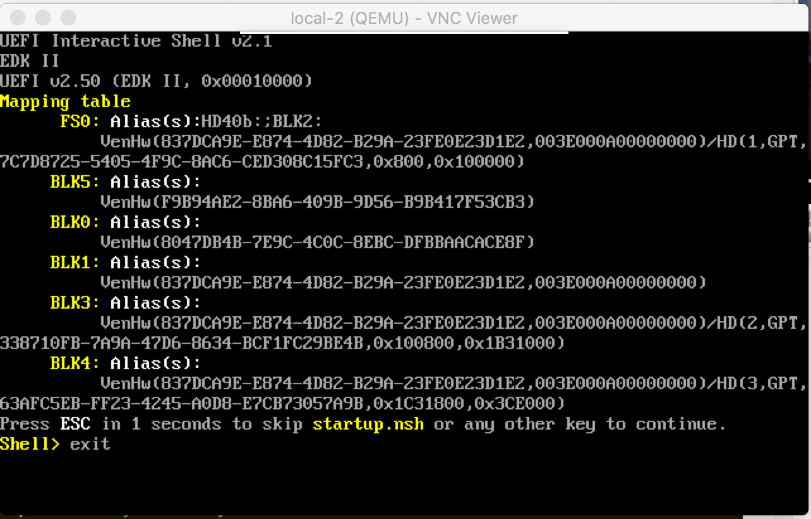

# How to Run Debian iso on QEMU ARMv8 (aarch64)

<!-- markdownlint-disable MD004 MD007 MD010 MD012 -->

## Install

1. Download [Debian ISO](https://mirrors.aliyun.com/debian-cd/9.5.0/arm64/iso-dvd/debian-9.5.0-arm64-DVD-1.iso)

2. Download [QEFI Flash](http://releases.linaro.org/components/kernel/uefi-linaro/latest/release/qemu64/QEMU_EFI.fd)

3. In **devenv** directory, start virtualbox and run _launch.sh install_:

    ```Bash
    [test@host devenv]$ vagrant up
    [test@host devenv]$ vagrant ssh
    vagrant@aadev:~$ ./launch.sh install
    Append CDROM /opt/src/images/debian-9.5.0-arm64-DVD-1.iso...
    🌞  Starting QEMU with 'qemu-system-aarch64'...
    QEMU 2.8.1 monitor - type 'help' for more information
    ```

4. Use a VNC client (e.g., VNC Viewer), connect to localhost:2 (port 127.0.0.1:5902)

## Add virtio drivers (Optional)

1. virtio-gpu
    ```Bash
    [test@host devenv]$ vagrant ssh
    # apt-get install libvirglrenderer-dev
    # If libvirglrenderer is missing, run following script to build from source
    vagrant@aadev:~$ /opt/src/images/install-virtio-gpu.sh
    ```

    * 参考 [virtio-gpu介绍](https://blog.csdn.net/ssdxiao0/article/details/52221422)

## Run QEMU VM

1. Reboot qemu vm and run again:

    ```Bash
    vagrant@aadev:~$ ./launch.sh
    ```

2. Fix UEFI ESP partion **error**
    
    - Type following command in shell:
    ```sh
    Shell> bcfg boot add 0 fs0:\efi\debian\grubaa64.efi "Debian 9"
    ```
    - See more [references](https://designprincipia.com/virtualize-uefi-on-arm-using-qemu/)

3. Boot "Debian 9"

4. In VNC client, you can see system is booting...


## Others

- install virt-manager

- kernel parameters
    - '-kernel aarch64-linux-3.15rc2-buildroot.img  --append "console=ttyAMA0"'
